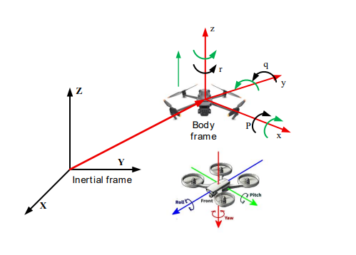
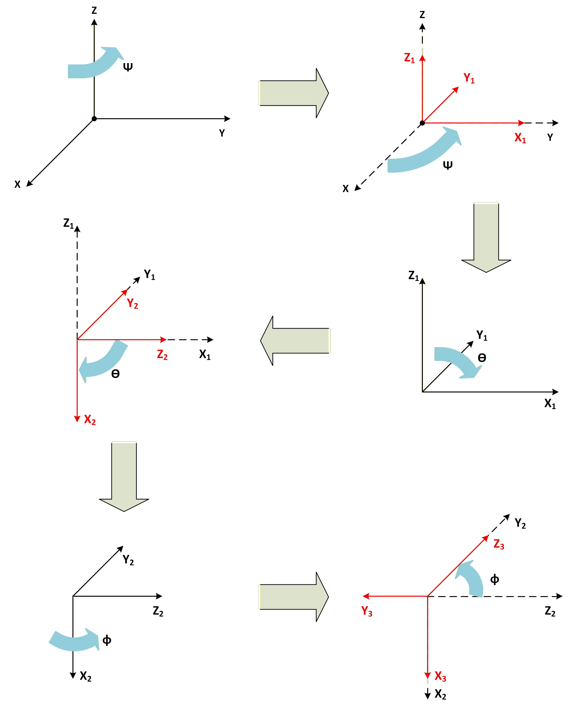
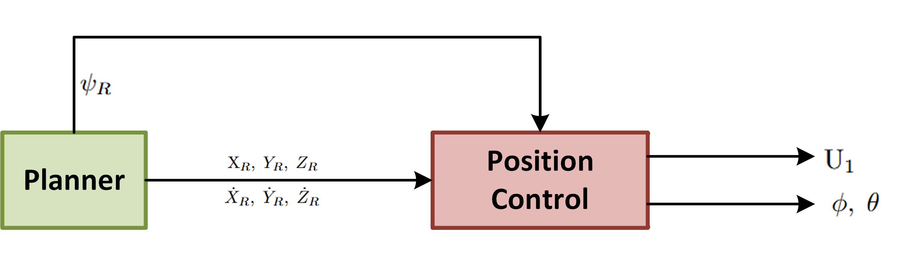
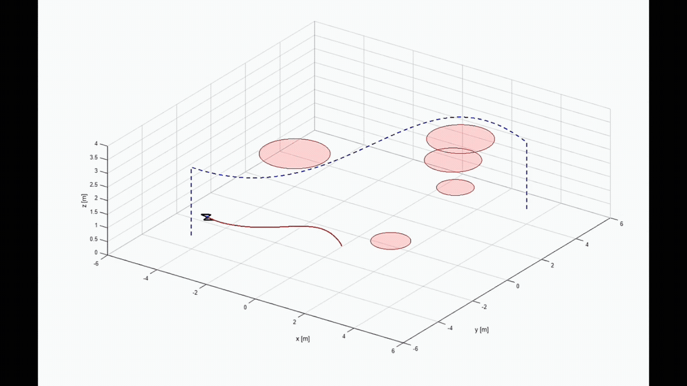
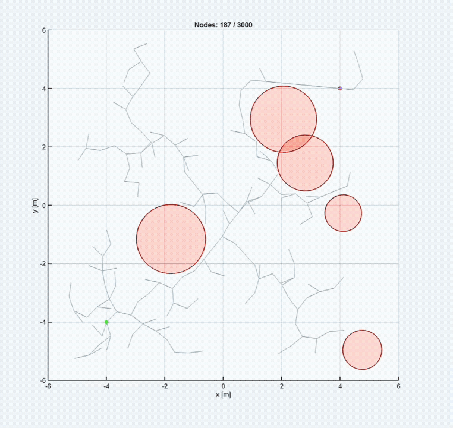

# Quadrotor RRT* + FL + LPV-MPC


> This repository was developed as part of my Second Project
> at Ho Chi Minh City University of Technology - Viet Nam National University (HCMUT - VNU).
>
> The project focuses on quadrotor trajectory tracking using a
> cascaded RRT* + Feedback Linearization + LPV-MPC framework,
> developed from several research papers in the fields of UAV control,
> LPV systems, and Model Predictive Control.
>
> The current work serves as the foundation for my undergraduate
> thesis, where the framework is being extended toward a more advanced
> autonomous UAV navigation and control system.
>
> **Note:** This repository is intentionally theory-oriented and
> contains detailed mathematical modeling, controller derivations,
> and algorithmic explanations.

A hierarchical trajectory-tracking framework for a quadrotor UAV:

**RRT\*** → **Feedback Linearization** → **LPV-MPC** → **Quadrotor**

<div align="center">
  
  <br><em>Overall control architecture.</em>
</div>

---

## 1. System Overview

```math
\mathrm{RRT}^*
\rightarrow
\mathbf{p}_{ref}
\rightarrow
\mathrm{Position\ Controller\ (FL)}
\rightarrow
\begin{bmatrix}
U_1 & \phi_{ref} & \theta_{ref}
\end{bmatrix}^{T}
\rightarrow
\mathrm{LPV\!-\!MPC}
\rightarrow
\begin{bmatrix}
U_2 & U_3 & U_4
\end{bmatrix}^{T}
```

```math
\mathbf{U}
=
\begin{bmatrix}
U_1 & U_2 & U_3 & U_4
\end{bmatrix}^{T}
```

<div align="center">
  
  <br><em>Earth-fixed and body-fixed reference frames.</em>
</div>

---

## 2. Quadrotor Model

The nonlinear plant is a 6-DOF Newton–Euler model:

```math
\mathbf{x}
=
\begin{bmatrix}
X & Y & Z & u & v & w &
\phi & \theta & \psi & p & q & r
\end{bmatrix}^{T}
```

```math
\mathbf{U}
=
\begin{bmatrix}
U_1 & U_2 & U_3 & U_4
\end{bmatrix}^{T}
```

<div align="center">
  
  <br><em>Euler-angle representation.</em>
</div>

The translational dynamics couple thrust and attitude:

```math
\ddot{Z}
=
-g+
\frac{U_1}{m}\cos\phi\cos\theta
```

---

## 3. Position Controller — Feedback Linearization

The outer loop tracks

```math
\mathbf{p}_{ref}
=
\begin{bmatrix}
X_{ref} & Y_{ref} & Z_{ref}
\end{bmatrix}^{T}
```

with

```math
\mathbf{e}_p
=
\mathbf{p}-\mathbf{p}_{ref}
```

The virtual acceleration is

```math
v_i
=
\ddot{x}_{ref,i}
-
K_{1,i}\dot e_i
-
K_{2,i}e_i
```

giving

```math
\ddot e_i
+
K_{1,i}\dot e_i
+
K_{2,i}e_i
=
0
```

and the inverse-dynamics mapping

```math
(v_x,v_y,v_z)
\rightarrow
(U_1,\phi_{ref},\theta_{ref})
```

<div align="center">
  
  <br><em>Position-controller signal flow.</em>
</div>

---

## 4. Attitude Controller — LPV-MPC

```math
\mathbf{x}_a
=
\begin{bmatrix}
\phi & \theta & \psi & p & q & r
\end{bmatrix}^{T}
```

```math
\mathbf{u}_a
=
\begin{bmatrix}
U_2 & U_3 & U_4
\end{bmatrix}^{T}
```

The nonlinear attitude dynamics are represented by

```math
\dot{\mathbf{x}}_a
=
A(\boldsymbol{\sigma})\mathbf{x}_a
+
B(\boldsymbol{\sigma})\mathbf{u}_a
```

The MPC uses incremental control:

```math
\Delta\mathbf{u}_{a,k}
=
\mathbf{u}_{a,k}
-
\mathbf{u}_{a,k-1}
```

with

```math
N_p=5
```

and cost function

```math
J
=
\sum_{k=0}^{N_p-1}
\left(
\mathbf{e}_k^TQ\mathbf{e}_k
+
\Delta\mathbf{u}_{a,k}^TR\Delta\mathbf{u}_{a,k}
\right)
```

subject to state and control constraints.

---

## 5. RRT* Path Planning

```math
X_{rand}
\rightarrow
X_{near}
\rightarrow
X_{new}
\rightarrow
\text{Neighbor Search}
\rightarrow
\text{Parent Selection}
\rightarrow
\text{Rewiring}
```

The accumulated cost is

```math
c(X_{new})
=
c(X_{parent})
+
Cost(X_{parent},X_{new})
```

and the environmental cost is represented by

```math
J_{path}
=
J_{length}
+
\lambda_{risk}J_{risk}
```

<div align="center">
  
  <br><em>RRT* tree expansion and optimal path extraction.</em>
</div>

The raw path is converted into a smooth trajectory:

```math
\mathcal{P}
=
\{X_0,X_1,\ldots,X_N\}
\rightarrow
\mathbf{p}_{ref}(t)
\rightarrow
\mathbf{v}_{ref}(t),\mathbf{a}_{ref}(t)
```

<div align="center">
  
  <br><em>Path smoothing and trajectory generation.</em>
</div>

---

## 6. Simulation

```math
\boxed{
\mathrm{RRT}^*
\rightarrow
\mathrm{FL}
\rightarrow
\mathrm{LPV\!-\!MPC}
\rightarrow
\mathrm{Quadrotor}
}
```

<div align="center">
  
  <br><em>Quadrotor trajectory-tracking simulation.</em>
</div>

<div align="center">
  
  <br><em>RRT* path-planning simulation.</em>
</div>

---

## 7. Repository Structure

```text
.
├── docs/
│   ├── 01_system_overview.md
│   ├── 02_reference_frames.md
│   ├── 03_quadrotors_dynamic_model.md
│   ├── 04_lpv_model.md
│   ├── 05_mpc_controller.md
│   ├── 06_position_controller.md
│   ├── 07_rrt_star_path_planning.md
│   └── 08_simulation_results.md
│
├── pics/
│   ├── sim/
│   │   ├── rrt_planner.gif
│   │   ├── sim_tracking.gif
│   │   └── readme.md
│   ├── control_architecture.png
│   ├── euler_angle_formation.png
│   ├── position_controller.png
│   ├── reference_frames.png
│   ├── rrt_star_algorithm.png
│   └── trajectory_smoothing.png
│
├── src/
└── README.md
```

## 8. Documentation

| Topic | Documentation |
|---|---|
| System architecture | [`01_system_overview.md`](docs/01_system_overview.md) |
| Reference frames | [`02_reference_frames.md`](docs/02_reference_frames.md) |
| Dynamic model | [`03_quadrotors_dynamic_model.md`](docs/03_quadrotors_dynamic_model.md) |
| LPV model | [`04_lpv_model.md`](docs/04_lpv_model.md) |
| LPV-MPC controller | [`05_mpc_controller.md`](docs/05_mpc_controller.md) |
| Position controller | [`06_position_controller.md`](docs/06_position_controller.md) |
| RRT* planning | [`07_rrt_star_path_planning.md`](docs/07_rrt_star_path_planning.md) |
| Simulation results | [`08_simulation_results.md`](docs/08_simulation_results.md) |

---

## 9. Key Idea

```math
\boxed{
\text{Plan}
\rightarrow
\text{Track Position}
\rightarrow
\text{Track Attitude}
\rightarrow
\text{Generate Rotor Commands}
}
```

**RRT\*** provides the path, **Feedback Linearization** handles position tracking, and **LPV-MPC** handles constrained attitude tracking.

## 10. References

[1] C. Trapiello Fernández,
*"Control of an UAV using LPV Techniques,"*
Master's thesis,
Universitat Politècnica de Catalunya,
Barcelona, Spain, 2018.

[2] S. Pal and A. K. Deb,
*"Linear Parameter Varying Model-Based Predictive Trajectory Tracking Control of Quadrotor,"*
in *2024 11th International Conference on Signal Processing and Integrated Networks (SPIN)*,
Noida, India, 2024.

[3] E. Alcalá, M. Facerías, and V. Puig,
*"Optimal LPV-based Control and Estimation for Autonomous Vehicles,"*
in *2020 28th Mediterranean Conference on Control and Automation (MED)*,
Saint-Raphaël, France, 2020.

[4] M. Misin,
*"LPV MPC Control of an Autonomous Aerial Vehicle,"*
in *2020 28th Mediterranean Conference on Control and Automation (MED)*,
Saint-Raphaël, France, 2020.

[5] P. Wang, Z. Man, Z. Cao, and J. Zheng,
*"Dynamics Modelling and Linear Control of Quadcopter,"*
in *2016 International Conference on Advanced Mechatronic Systems (ICAMechS)*,
Melbourne, Australia, 2016.

[6] K. Bouzgou, Y. Bestaoui, L. Benchikh, B. Ibari, and Z. Ahmed-Foitih,
*"Dynamic Modeling, Simulation and PID Controller of Unmanned Aerial Vehicle UAV,"*
in *2017 Seventh International Conference on Innovative Computing Technology (INTECH)*,
Luton, UK, 2017.
