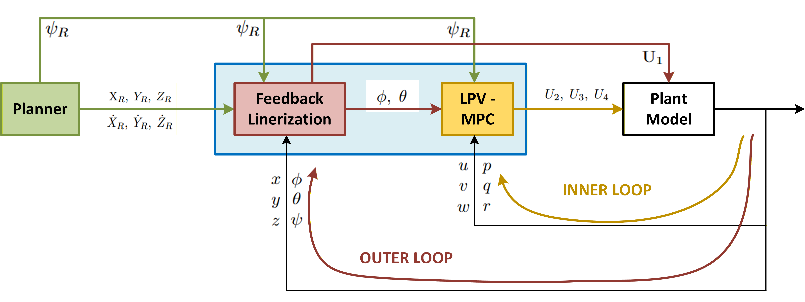

# 01. System Overview

## 1.1 Overview

This project develops a hierarchical control framework for trajectory
tracking of a quadrotor UAV.

The proposed framework combines:

- RRT* for motion planning
- Feedback Linearization (FL) for position control
- Linear Parameter-Varying Model Predictive Control (LPV-MPC)
  for attitude control
- MATLAB/Simulink for simulation and validation

The overall architecture separates the slower position dynamics from
the faster attitude dynamics, enabling independent controller design
while maintaining the interaction between the two loops.

  <i>Figure: Block diagram of the proposed quadrotor control system.</i>

## 1.2 Control Architecture

The system is organized into two nested control loops.

### Outer Loop — Position Control

The outer loop regulates the quadrotor position

\[
\mathbf{p} = [x,\ y,\ z]^T
\]

and tracks the reference trajectory generated by the motion planner.

Feedback Linearization is used to compensate for the nonlinear
translational dynamics and generate:

- Total thrust command \(U_1\)
- Reference attitude angles

These commands are passed to the inner-loop attitude controller.

### Inner Loop — Attitude Control

The inner loop regulates the attitude of the quadrotor using an
LPV-MPC controller.

The LPV model represents the nonlinear attitude dynamics as a
linear system with time-varying parameters, while MPC handles
the optimization and physical constraints on the control inputs.

The inner loop operates at a higher bandwidth than the outer
position loop.

## 1.3 Development Flow

The overall control process is:

\[
\text{RRT*}
\rightarrow
\text{Reference Trajectory}
\rightarrow
\text{Position Controller (FL)}
\rightarrow
\text{Attitude Reference}
\rightarrow
\text{Attitude Controller (LPV-MPC)}
\rightarrow
\text{Quadrotor}
\]

The complete framework is validated through MATLAB/Simulink
simulation, with emphasis on trajectory tracking accuracy,
stability, transient response, and constraint satisfaction.

## 1.4 Project Objectives

The main objectives are:

1. Develop a mathematical model of the quadrotor.
2. Design a hierarchical position and attitude control architecture.
3. Develop an LPV-MPC-based attitude controller with physical
   constraints.
4. Develop a Feedback Linearization-based position controller.
5. Generate reference trajectories using RRT*.
6. Validate the complete system in MATLAB/Simulink.
