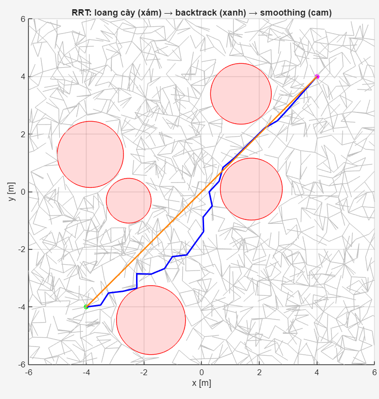
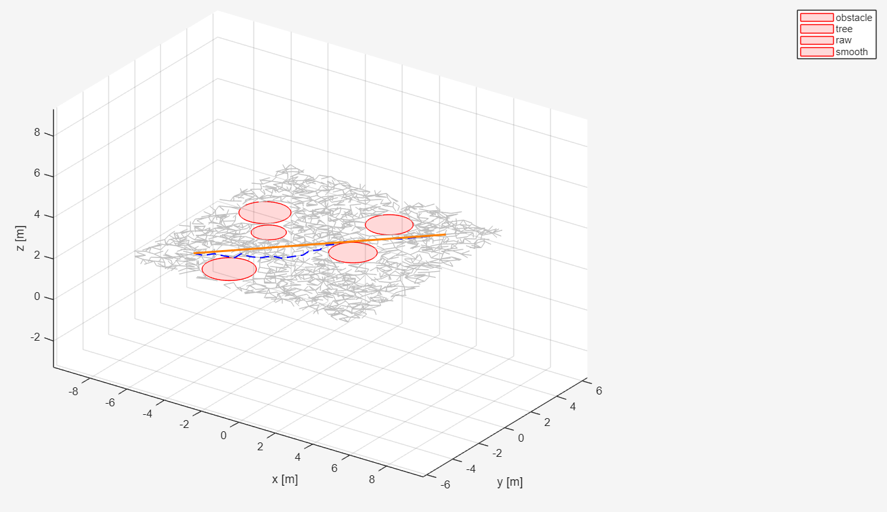

# 07. RRT* Path Planning

## 7.1 Overview

RRT* is used as the high-level motion planning algorithm.

Its role is to generate a collision-free reference trajectory
from the initial state to the desired goal state.

The generated trajectory provides reference information for the
lower-level position and attitude controllers.

<div align="center">



<p><em>Figure: Stochastic Tree Expansion and Optimal Path Extraction via RRT* Algorithm.</em></p>

</div>

## 7.2 Standard RRT

Rapidly-exploring Random Tree (RRT) is a sampling-based method
for exploring high-dimensional configuration spaces.

At each iteration, the algorithm:

1. Samples a random state $X_{rand}$.
2. Finds the nearest existing node $X_{near}$.
3. Steers from $X_{near}$ toward $X_{rand}$.
4. Checks whether the new edge is collision-free.
5. Adds the new node to the tree.

The random state is sampled from the collision-free configuration
space:

```math
X_{rand}
\sim
SampleRandom(\mathcal{X}_{free})
```

The nearest node is determined by

```math
X_{near}
=
\arg\min_{X \in V}
dist(X,X_{rand})
```

where $V$ represents the set of nodes currently contained in
the tree.

A new node is generated using the steering function:

```math
X_{new}
=
Steer(X_{near},X_{rand})
```

The new node is added to the tree only when the corresponding
edge is collision-free.

The process continues until the tree reaches the goal region.

## 7.3 Limitation of Standard RRT

Although standard RRT provides efficient exploration, the resulting
path may be:

- Jagged
- Stochastic
- Sub-optimal

The random sampling process does not explicitly optimize the
resulting path.

Consequently, the generated path may contain unnecessary
detours or have a larger path length than required.

## 7.4 RRT* Improvement

RRT* extends RRT by introducing local path optimization.

After generating a new node, RRT*:

1. Searches neighboring nodes.
2. Selects the parent with minimum accumulated cost.
3. Rewires neighboring nodes when a lower-cost connection is found.

The accumulated cost of a node can be expressed as

```math
c(X_{new})
=
c(X_{parent})
+
Cost(X_{parent},X_{new})
```

The optimal parent is selected according to

```math
X_{parent}^{*}
=
\arg\min_{X \in X_{nearby}}
\left[
c(X)
+
Cost(X,X_{new})
\right]
```

After the optimal parent is selected, neighboring nodes are
rewired when connecting them through $X_{new}$ results in a
lower accumulated cost.

The rewiring condition can be expressed as

```math
c(X_{new})
+
Cost(X_{new},X)
<
c(X)
```

provided that the new connection is collision-free.

Through repeated sampling and rewiring, the RRT* solution
converges toward an optimal path as the number of samples
increases.

## 7.5 RRT* Algorithm

The main procedure is summarized as follows.

### Step 1 — Random Sampling

A random state is sampled from the free configuration space:

```math
X_{rand}
\sim
SampleRandom(\mathcal{X}_{free})
```

### Step 2 — Nearest Node Search

The nearest existing node is found using

```math
X_{near}
=
\arg\min_{X \in V}
dist(X,X_{rand})
```

### Step 3 — Steering

The algorithm generates a new node toward the random sample:

```math
X_{new}
=
Steer(X_{near},X_{rand})
```

### Step 4 — Collision Checking

The new edge is checked against the environment.

The connection is accepted only if

```math
CollisionFree(X_{near},X_{new})
=
True
```

### Step 5 — Neighbor Search

A set of neighboring nodes is obtained using a neighborhood
radius $r_n$:

```math
X_{nearby}
=
\left\{
X \in V
\mid
dist(X,X_{new}) \leq r_n
\right\}
```

The neighborhood radius is adapted according to the number
of nodes in the tree.

### Step 6 — Optimal Parent Selection

The parent that produces the lowest accumulated cost is selected:

```math
X_{parent}^{*}
=
\arg\min_{X \in X_{nearby}}
\left[
c(X)
+
Cost(X,X_{new})
\right]
```

### Step 7 — Tree Rewiring

For each neighboring node, the algorithm checks whether a
lower-cost path can be obtained through $X_{new}$.

If

```math
c(X_{new})
+
Cost(X_{new},X)
<
c(X)
```

and the connection is collision-free, the neighboring node is
rewired through $X_{new}$.

This local optimization is the key difference between standard
RRT and RRT*.

## 7.6 Environmental Constraints

The planner considers:

- Physical obstacles
- Radar exposure / no-fly regions

Therefore, the generated path is evaluated not only for
collision avoidance but also according to the defined
environmental constraints.

A general path cost can be expressed as

```math
J_{path}
=
J_{length}
+
\lambda_{risk}J_{risk}
```

where:

- $J_{length}$: path-length cost
- $J_{risk}$: environmental or radar-exposure cost
- $\lambda_{risk}$: weighting factor for environmental risk

This allows the planner to consider both geometric path length
and environmental constraints during path optimization.

## 7.7 Trajectory Post-Processing

The raw RRT* path consists of piecewise-linear segments.

To obtain a trajectory suitable for the controller, the path is
post-processed using spline interpolation.

<div align="center">



<p><em>Figure: Trajectory Post-Processing: From Raw Piecewise Linear Path to Smooth Spline Interpolation.</em></p>

</div>

The raw path can be represented as a sequence of waypoints:

```math
\mathcal{P}
=
\left\{
X_0,
X_1,
\ldots,
X_N
\right\}
```

where each waypoint is defined as

```math
X_i
=
\begin{bmatrix}
x_i \\
y_i \\
z_i
\end{bmatrix}
```

Spline interpolation is then applied to generate a continuous
and differentiable trajectory.

The resulting reference position is

```math
\mathbf{p}_{ref}(t)
=
\begin{bmatrix}
X_{ref}(t) \\
Y_{ref}(t) \\
Z_{ref}(t)
\end{bmatrix}
```

and the corresponding reference velocity is

```math
\mathbf{v}_{ref}(t)
=
\dot{\mathbf{p}}_{ref}(t)
```

The reference acceleration can also be obtained from

```math
\mathbf{a}_{ref}(t)
=
\ddot{\mathbf{p}}_{ref}(t)
```

when required by the position controller.

The resulting trajectory provides the reference position and
velocity information required by the position controller.

## 7.8 Planner–Controller Interface

The complete information flow is

```math
\text{RRT*}
\longrightarrow
\text{Reference Trajectory}
\longrightarrow
\text{Position Controller}
\longrightarrow
\text{Attitude Controller}
\longrightarrow
\text{Quadrotor}
```

The RRT* planner generates the geometric path and the subsequent
trajectory post-processing generates the time-dependent reference
trajectory.

The position controller receives the reference position and
generates the total thrust and reference roll and pitch angles.

The attitude controller then tracks the resulting attitude
reference using the LPV-MPC controller.

RRT* therefore operates as the high-level planning layer, while
the cascaded Feedback Linearization and LPV-MPC controllers
perform trajectory tracking.
